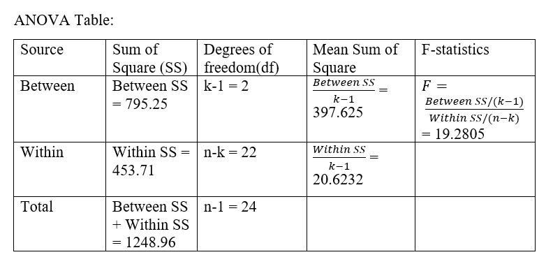

```{r echo=FALSE}
library(tidyverse)
library(arsenal)
```

## **Problem 1**

In the context of ANOVA model, prove the partitioning of the total variability (sum of squares).

------------------------------------

##### **solution:**

We start the proof from the fact that difference between each observation and the grand mean equals the sum of within group variability and between group variability. 
$$
\begin{split}
y_{ij}: \ denote \ the \ observation \ from \ the \ j^{th} \ subject \ from  \ the \  i^{th} \  group. \\
\bar{\bar{y}}: \ denote \ the  \ grand \ mean \\
\bar{y}_i: \ denote \ the  \ mean \ from \ the \ i^{th} \  group. \\
y_{ij} - \bar{\bar{y}}: difference \ between \ each \ observation \ and \ the \ grand \ mean \\
y_{ij} - \bar{y}_i: within \ group \ variability \\
\bar{y}_i - \bar{\bar{y}}: between \ group \ variability \\
y_{ij} - \bar{\bar{y}} = (y_{ij} - \bar{y}_i) + (\bar{y}_i - \bar{\bar{y}}) 
\end{split}
$$
We then square and take the total sum of both sides of the equation
$$
\begin{split}
\sum ^k_{i=1}\sum^{n_i}_{j=1}(y_{ij} - \bar{\bar{y}})^2 = \sum ^k_{i=1}\sum^{n_i}_{j=1}[(y_{ij} - \bar{y_i}) + (\bar{y_i}-\bar{\bar{y}})]^2
\end{split}
$$
We then expand the right side of the equation
$$
\begin{split}
\sum ^k_{i=1}\sum^{n_i}_{j=1}(y_{ij} - \bar{\bar{y}})^2 = \sum ^k_{i=1}\sum^{n_i}_{j=1}(y_{ij} - \bar{y_i})^2 +2\sum ^k_{i=1}\sum^{n_i}_{j=1}(y_{ij} - \bar{y_i})(\bar{y_i}-\bar{\bar{y}}) + \sum ^k_{i=1}\sum^{n_i}_{j=1}(\bar{y_i}-\bar{\bar{y}})^2 \\
\sum ^k_{i=1}\sum^{n_i}_{j=1}(y_{ij} - \bar{y_i})(\bar{y_i}-\bar{\bar{y}}) = 0 \\
\Rightarrow\sum ^k_{i=1}\sum^{n_i}_{j=1}(y_{ij} - \bar{\bar{y}})^2 = \sum ^k_{i=1}\sum^{n_i}_{j=1}(y_{ij} - \bar{y_i})^2  + \sum ^k_{i=1}\sum^{n_i}_{j=1}(\bar{y_i}-\bar{\bar{y}})^2
\end{split}
$$
We thus complete the proof of partitioning of the total variability

------------------

## **Problem 2**

load the data
```{r}
knee_df = read_csv("./data/Knee.csv")
```

##### **a)**

The descriptive statistics for each group are displayed below:

```{r}
my_controls <- tableby.control(
               total = T,
               test = F,
               numeric.stats = c("meansd", "medianq1q3","iqr","range", "Nmiss2"),
               cat.stats = c("countpct", "Nmiss2"),
               stats.labels = list(
               meansd = "Mean (SD)",
               medianq1q3 = "Median (Q1, Q3)",
               iqr = "IQR",
               range = "Min - Max",
               Nmiss2 = "Missing",
               countpct = "N (%)")
              )


tab1 <- tableby(~Below + Average + Above,data = knee_df, control = my_controls)

knitr::kable(summary(tab1, title = "Descriptive Statistics"))
```

There are 2 missing value for Below average group, 3 missing for Above group and no data missing for average. The Below average group has the longest mean time required until rehabilitation among three groups and the above average group has the smallest mean time. Furthermore, the below average group also has the largest standard deviation for the mean time until rehabilitation and the average group has the smallest standard deviation for the mean time until rehabilitation. The longest time required in physical therapy until successful rehabilitation is 42 days which also belongs to the below average group; the shortest time required in physical therapy until successful rehabilitation is 21 days which belongs to the above average group. 

##### **b)**
We are using $\alpha = 0.01$ for the ANOVA test and the test hypotheseses are shown below:

$$
\begin{split}
H_0: \mu_{below}=\mu_{average}=\mu _{above}\\
H_1: at~least~two~means~are~not~equal\\
Between~SS = \sum_{i=1}^k\sum_{j=1}^{n_i}(\bar{y_i} - \bar{\bar{y}})^2\\
Within~SS = \sum_{i=1}^k\sum_{j=1}^{n_i}(y_{ij}-\bar{y_i})^2\\
Between~Mean~Square = \frac{\sum_{i=1}^k\sum_{j=1}^{n_i}(\bar{y_i} - \bar{\bar{y}})^2}{k-1}=\frac{\sum_{i=1}^kn_i\bar{y_i}^2-\frac{y_{..}^2}{n}}{k-1}\\
Within~Mean~Square = \frac{\sum_{i=1}^k\sum_{j=1}^{n_i}(y_{ij}-\bar{y_i})^2}{n-k}=\frac{\sum_{i=1}^k(n_i-1)s_i^2}{n-k}\\
F_{stat} = \frac{Between~Mean~Square}{Within~Mean~Square} \sim F(k-1,n-k)
\end{split}
$$

```{r}
# Re-shape the data
mean_time = c(knee_df$Below,knee_df$Average,knee_df$Above)
group = c(rep("blow",length(knee_df$Below)),rep("average",length(knee_df$Average)),rep("above",length(knee_df$Above)))
new_knee_df = as.data.frame(cbind(mean_time,group)) %>% drop_na()

# Perform an ANOVA test
# Function lm() is broader, including linear regression models
res = lm(mean_time~factor(group), data=new_knee_df)

# Coefficients of the ANOVA model with 'grand mean' and alpha effects.
# Will use them later in regression.
res

# Our regular ANOVA table with SS, Mean SS and F-test
anova(res)
```
The ANOVA table is shown below: 


```{r}
#critical value
qf(0.99,2,22)

```
$$
\begin{split}
F_{stat} = \frac{397.625}{20.6232} = 19.2805  \sim F(2,22) \\
F_{k-1,n-k,1-\alpha} = 5.719 \\
F_{stat} > F_{2,122,1-0.01}
\end{split}
$$
Since F (19.2805) is greater than $F_{2,22,0.99}$ (`r qf(0.99,2,22)`) We rejected the null hypothesis and conclude that at $\alpha$ level of 0.01 that there is a significant difference in the mean time (days) required in physical therapy until successful rehabilitation between the groups with different pysical status.
